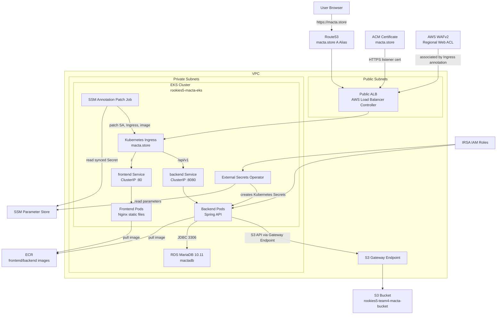
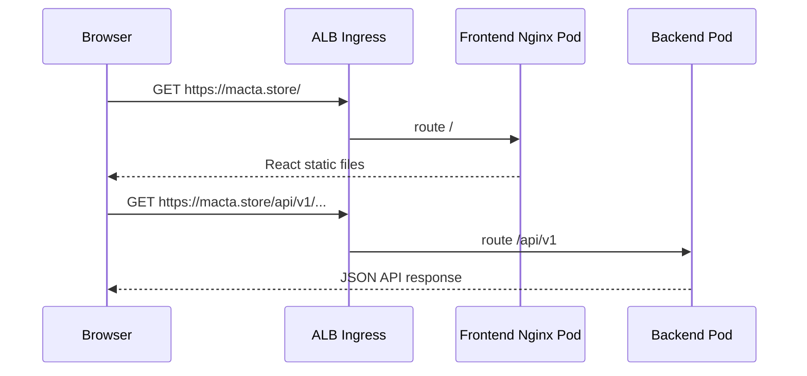

# MACTA Infra

SK쉴더스 루키즈 개발 5기 미니프로젝트3 **MACTA** 서비스를 AWS 기반으로 배포하기 위한 인프라 레포입니다. Terraform으로 AWS 리소스를 구성하고, Kubernetes manifest와 Argo CD를 통해 EKS 위에 프론트엔드/백엔드 애플리케이션을 배포하는 구조입니다.

현재 구조의 핵심은 다음과 같습니다.

- Terraform: VPC, EKS, RDS, S3, ECR, WAF, IRSA, Helm 기반 컨트롤러 설치
- EKS: 프론트엔드, 백엔드, Ingress, External Secrets 리소스 실행
- SSM Parameter Store: DB, S3, IAM Role ARN, WAF ARN, ACM ARN 등 환경별 값을 저장
- External Secrets Operator: SSM 값을 Kubernetes Secret으로 동기화
- AWS Load Balancer Controller: Kubernetes Ingress를 보고 ALB 생성
- Route53 + ACM: `macta.store` 도메인과 HTTPS 인증서 연결
- 통신 구조: 정적 파일은 프론트 Nginx가 서빙하고, 동적 API 호출은 ALB가 `/api/v1` 경로로 백엔드 서비스에 직접 전달

## 전체 구조



## 요청 라우팅



프론트엔드 Nginx는 React 정적 파일과 SPA fallback만 담당합니다.

```nginx
server {
    listen 80;

    location / {
        root /usr/share/nginx/html;
        index index.html;
        try_files $uri $uri/ /index.html;
    }
}
```

프론트엔드의 API base URL은 같은 도메인 상대경로를 권장합니다.

```env
VITE_API_BASE_URL=/api/v1
```

## 주요 AWS 리소스

| 영역 | 리소스 |
| --- | --- |
| Network | VPC, Public Subnet 2개, Private Subnet 2개, Internet Gateway, NAT Gateway, Route Table |
| EKS | EKS Cluster, Managed Node Group, OIDC Provider, IRSA |
| Container Registry | ECR backend repository, ECR frontend repository |
| Database | RDS MariaDB 10.11, private subnet 배치 |
| Storage | S3 Bucket, S3 Gateway VPC Endpoint |
| Load Balancing | AWS Load Balancer Controller, ALB Ingress |
| Security | WAFv2 Web ACL, ACM Certificate, IAM Policy/Role |
| Secrets | SSM Parameter Store, External Secrets Operator |
| GitOps | Argo CD Application manifests |

## 디렉터리 구조

```text
infra/
  argocd/
    backend-application.yml
    frontend-application.yml
  k8s/
    ingress.yaml
    ssm-annotation-patch-job.yaml
    backend/
      namespace.yaml
      backend.yaml
      external-secret.yaml
    frontend/
      frontend.yaml
  terraform/
    main.tf
    variables.tf
    outputs.tf
    vpc.tf
    eks.tf
    ecr.tf
    rds.tf
    s3.tf
    waf.tf
    external-secrets.tf
    aws-load-balancer-controller.tf
    policies/
      aws-load-balancer-controller-iam-policy.json
```

## Terraform 기본값

| 항목 | 값 |
| --- | --- |
| AWS region | `ap-northeast-2` |
| AWS profile | `team4` |
| Project name | `rookies5-macta` |
| Environment | `dev` |
| EKS cluster | `rookies5-macta-eks` |
| Kubernetes namespace | `rookies5-macta` |
| Backend ServiceAccount | `backend-sa` |
| External Secrets namespace | `external-secrets` |
| External Secrets ServiceAccount | `external-secrets` |
| Domain | `macta.store` |

DB 계정 정보는 `terraform/terraform.tfvars`에서 관리합니다. 이 파일은 Git에 올리지 않습니다.

```hcl
db_instance_class = "db.t3.micro"
db_name           = "mactadb"
db_username       = "admin"
db_password       = "change-me"
```

## Terraform 적용

```powershell
cd C:\rookies\macta\infra\terraform
$env:AWS_PROFILE = "team4"

terraform init
terraform fmt
terraform validate
terraform plan
terraform apply
```

kubeconfig 설정:

```powershell
aws eks update-kubeconfig --profile team4 --region ap-northeast-2 --name rookies5-macta-eks
```

주요 output 확인:

```powershell
terraform output -raw eks_cluster_name
terraform output -raw ecr_backend_repository_url
terraform output -raw ecr_frontend_repository_url
terraform output -raw backend_sa_role_arn
terraform output -raw rds_db_url
terraform output -raw s3_bucket_name
terraform output -raw waf_web_acl_arn
```

## SSM Parameter Store

Kubernetes YAML에는 DB 비밀번호, DB URL, ARN, 인증서 ARN 같은 환경별 값을 직접 넣지 않습니다. SSM Parameter Store에 저장하고 External Secrets Operator가 Kubernetes Secret으로 동기화합니다.

현재 manifest가 참조하는 SSM 경로는 다음과 같습니다.

| SSM parameter | 용도 |
| --- | --- |
| `/rookies5-macta/dev/backend/DB_URL` | 백엔드 DB JDBC URL |
| `/rookies5-macta/dev/backend/DB_USERNAME` | DB 사용자명 |
| `/rookies5-macta/dev/backend/DB_PASSWORD` | DB 비밀번호 |
| `/rookies5-macta/dev/backend/S3_BUCKET_NAME` | S3 버킷명 |
| `/rookies5-macta/dev/backend/AWS_REGION` | AWS region |
| `/rookies5-macta/dev/infra/BACKEND_ROLE_ARN` | 백엔드 IRSA Role ARN |
| `/rookies5-macta/dev/infra/WAF_WEB_ACL_ARN` | WAF Web ACL ARN |
| `/rookies5-macta/dev/infra/ACM_CERTIFICATE_ARN` | ACM 인증서 ARN |
| `/rookies5-macta/dev/infra/BACKEND_IMAGE` | 백엔드 이미지 URI |
| `/rookies5-macta/dev/infra/FRONTEND_IMAGE` | 프론트엔드 이미지 URI |

SSM 값 생성 예시:

```powershell
cd C:\rookies\macta\infra\terraform

$backendRoleArn = terraform output -raw backend_sa_role_arn
$wafWebAclArn   = terraform output -raw waf_web_acl_arn
$backendImage   = "$(terraform output -raw ecr_backend_repository_url):latest"
$frontendImage  = "$(terraform output -raw ecr_frontend_repository_url):latest"
$dbUrl          = terraform output -raw rds_db_url
$s3BucketName   = terraform output -raw s3_bucket_name

aws ssm put-parameter --profile team4 --region ap-northeast-2 --name "/rookies5-macta/dev/backend/DB_URL" --type SecureString --value $dbUrl --overwrite
aws ssm put-parameter --profile team4 --region ap-northeast-2 --name "/rookies5-macta/dev/backend/DB_USERNAME" --type SecureString --value "admin" --overwrite
aws ssm put-parameter --profile team4 --region ap-northeast-2 --name "/rookies5-macta/dev/backend/DB_PASSWORD" --type SecureString --value "CHANGE_ME" --overwrite
aws ssm put-parameter --profile team4 --region ap-northeast-2 --name "/rookies5-macta/dev/backend/S3_BUCKET_NAME" --type SecureString --value $s3BucketName --overwrite
aws ssm put-parameter --profile team4 --region ap-northeast-2 --name "/rookies5-macta/dev/backend/AWS_REGION" --type String --value "ap-northeast-2" --overwrite

aws ssm put-parameter --profile team4 --region ap-northeast-2 --name "/rookies5-macta/dev/infra/BACKEND_ROLE_ARN" --type SecureString --value $backendRoleArn --overwrite
aws ssm put-parameter --profile team4 --region ap-northeast-2 --name "/rookies5-macta/dev/infra/WAF_WEB_ACL_ARN" --type SecureString --value $wafWebAclArn --overwrite
aws ssm put-parameter --profile team4 --region ap-northeast-2 --name "/rookies5-macta/dev/infra/ACM_CERTIFICATE_ARN" --type SecureString --value "CHANGE_ME_ACM_CERTIFICATE_ARN" --overwrite
aws ssm put-parameter --profile team4 --region ap-northeast-2 --name "/rookies5-macta/dev/infra/BACKEND_IMAGE" --type SecureString --value $backendImage --overwrite
aws ssm put-parameter --profile team4 --region ap-northeast-2 --name "/rookies5-macta/dev/infra/FRONTEND_IMAGE" --type SecureString --value $frontendImage --overwrite
```

조회:

```powershell
aws ssm get-parameters-by-path --profile team4 --region ap-northeast-2 --path "/rookies5-macta/dev" --recursive --with-decryption --query "Parameters[*].[Name,Type,Value]" --output table
```

## External Secrets

Terraform은 External Secrets Operator를 Helm으로 설치합니다.

- Namespace: `external-secrets`
- ServiceAccount: `external-secrets`
- 인증 방식: IRSA
- SSM 권한: `ssm:GetParameter`, `ssm:GetParameters`, `ssm:GetParametersByPath`, `ssm:DescribeParameters`

Kubernetes manifest:

- `k8s/backend/external-secret.yaml`
  - `ClusterSecretStore`: AWS SSM Parameter Store 연결
  - `ExternalSecret rookies5-macta-backend-secret`: 백엔드 런타임 환경변수 Secret 생성
  - `ExternalSecret rookies5-macta-infra-config`: IAM Role, WAF, ACM, 이미지 URI Secret 생성

확인:

```powershell
kubectl get deployment -n external-secrets external-secrets
kubectl get externalsecret -n rookies5-macta
kubectl get secret backend-secret -n rookies5-macta
kubectl get secret rookies5-macta-infra-config -n rookies5-macta
```

## Kubernetes 배포

수동 적용:

```powershell
cd C:\rookies\macta\infra

kubectl apply -f .\k8s\backend\namespace.yaml
kubectl apply -f .\k8s\backend\external-secret.yaml
kubectl apply -f .\k8s\backend\backend.yaml
kubectl apply -f .\k8s\frontend\frontend.yaml
kubectl apply -f .\k8s\ingress.yaml
kubectl apply -f .\k8s\ssm-annotation-patch-job.yaml
```

확인:

```powershell
kubectl get pods -n rookies5-macta
kubectl get svc -n rookies5-macta
kubectl get ingress -n rookies5-macta
```

## Ingress, ALB, HTTPS

ALB는 Terraform에서 직접 생성하지 않습니다. `k8s/ingress.yaml`을 적용하면 AWS Load Balancer Controller가 Ingress를 감지해 public ALB를 생성합니다.

현재 라우팅:

```text
https://macta.store/        -> rookies5-macta-frontend-service:80
https://macta.store/api/v1  -> rookies5-macta-backend-service:8080
```

Ingress 기본 annotation:

```yaml
metadata:
  annotations:
    kubernetes.io/ingress.class: alb
    alb.ingress.kubernetes.io/scheme: internet-facing
    alb.ingress.kubernetes.io/target-type: ip
    alb.ingress.kubernetes.io/listen-ports: '[{"HTTP":80}]'
spec:
  ingressClassName: alb
  rules:
    - host: macta.store
```

WAF/ACM/HTTPS annotation은 SSM에서 값을 읽은 patch Job이 주입합니다.

- `alb.ingress.kubernetes.io/wafv2-acl-arn`
- `alb.ingress.kubernetes.io/certificate-arn`
- `alb.ingress.kubernetes.io/listen-ports: [{"HTTP":80},{"HTTPS":443}]`
- `alb.ingress.kubernetes.io/ssl-redirect: "443"`

확인:

```powershell
kubectl describe ingress rookies5-macta-frontend-ingress -n rookies5-macta
```

## Route53 and ACM

도메인:

```text
macta.store
```

Route53 public hosted zone에 필요한 레코드:

| 이름 | 타입 | 대상 |
| --- | --- | --- |
| `macta.store` | `A Alias` | ALB dualstack DNS |
| `*.macta.store` | `A Alias` | ALB dualstack DNS, 필요 시 |
| `_...macta.store` | `CNAME` | ACM DNS validation |

주의:

- ACM DNS validation CNAME은 인증서 검증용입니다. 서비스 트래픽을 ALB로 보내지 않습니다.
- `*.macta.store`는 `www.macta.store`, `api.macta.store` 같은 서브도메인에만 매칭됩니다.
- 루트 도메인 `macta.store`를 쓰려면 별도 `macta.store A Alias -> ALB` 레코드가 필요합니다.
- ALB 기본 DNS로 HTTPS 접속하면 인증서 이름이 맞지 않아 브라우저 경고가 납니다. 최종 접속은 `https://macta.store`로 확인합니다.

DNS 확인:

```powershell
nslookup macta.store
nslookup macta.store 8.8.8.8
```

## RDS

현재 RDS 엔진은 MySQL이 아니라 MariaDB입니다.

| 항목 | 값 |
| --- | --- |
| Engine | `mariadb` |
| Engine version | `10.11` |
| DB name | `mactadb` |
| Port | `3306` |
| Subnet | Private subnets |
| Public access | disabled |

JDBC URL은 MariaDB의 MySQL 호환 프로토콜을 사용해 다음 형태로 구성합니다.

```text
jdbc:mysql://<rds-endpoint>:3306/mactadb?serverTimezone=Asia/Seoul&characterEncoding=UTF-8
```

이 값은 SSM의 `/rookies5-macta/dev/backend/DB_URL`에 저장하고, External Secrets가 `backend-secret`으로 동기화합니다.

## S3

S3는 애플리케이션 파일 저장소로 사용합니다.

- Bucket: `rookies5-team4-macta-bucket`
- Public access block 적용
- EKS private subnet에서 S3 Gateway Endpoint로 접근
- 백엔드 Pod는 IRSA Role을 통해 S3 권한 사용

백엔드 ServiceAccount:

```text
backend-sa
```

IRSA annotation은 SSM 값을 읽은 patch Job이 주입합니다.

```text
eks.amazonaws.com/role-arn=<BACKEND_ROLE_ARN>
```

확인:

```powershell
kubectl get serviceaccount backend-sa -n rookies5-macta -o yaml
```

## ECR and Images

Terraform이 ECR repository를 생성합니다.

```powershell
terraform output -raw ecr_backend_repository_url
terraform output -raw ecr_frontend_repository_url
```

이미지 예시:

```text
105588835975.dkr.ecr.ap-northeast-2.amazonaws.com/rookies5-macta/backend:<tag>
105588835975.dkr.ecr.ap-northeast-2.amazonaws.com/rookies5-macta/frontend:<tag>
```

현재 Kubernetes manifest의 `image`는 placeholder로 둘 수 있습니다. 실제 이미지는 CI/CD 또는 SSM patch Job에서 반영합니다.

이미지 pull 오류 확인:

```powershell
kubectl describe pod -n rookies5-macta -l app=rookies5-macta-frontend
kubectl describe pod -n rookies5-macta -l app=rookies5-macta-backend
```

## WAF

Terraform은 Regional WAF Web ACL을 생성합니다.

적용 rule:

- Rate limit per IP
- AWS Managed Rules Common Rule Set
- AWS Managed Rules Known Bad Inputs Rule Set
- AWS Managed Rules SQLi Rule Set

WAF는 생성만으로 ALB에 자동 연결되지 않습니다. 현재 구조에서는 WAF ARN을 SSM에 저장하고, `ssm-annotation-patch-job`이 Ingress annotation으로 주입합니다.

```text
alb.ingress.kubernetes.io/wafv2-acl-arn=<WAF_WEB_ACL_ARN>
```

## Argo CD

Argo CD는 애플리케이션 배포 상태를 확인하고 GitOps 방식으로 manifest를 sync하기 위한 도구입니다.

프론트엔드/백엔드 레포에서 이미지 빌드 후 infra manifest를 갱신하더라도 Argo CD가 즉시 변경사항을 감지하지 못할 수 있습니다. 이를 줄이기 위해 Argo CD webhook을 함께 사용합니다. GitHub push 이벤트가 Argo CD webhook으로 전달되면 Application refresh가 트리거되어 기본 polling 주기를 기다리지 않고 빠르게 sync 대상 변경을 감지할 수 있습니다.

설치 예시:

```powershell
kubectl create namespace argocd
kubectl apply --server-side --force-conflicts -n argocd -f https://raw.githubusercontent.com/argoproj/argo-cd/stable/manifests/install.yaml
```

UI를 임시로 볼 때:

```powershell
kubectl port-forward svc/argocd-server -n argocd 8080:443
```

브라우저:

```text
https://localhost:8080
```

초기 비밀번호:

```powershell
$encoded = kubectl get secret argocd-initial-admin-secret -n argocd -o jsonpath="{.data.password}"
[System.Text.Encoding]::UTF8.GetString([System.Convert]::FromBase64String($encoded))
```

LoadBalancer로 노출할 수도 있지만, 실습 후에는 `ClusterIP`로 되돌리는 것을 권장합니다.

```powershell
kubectl patch svc argocd-server -n argocd --type merge -p '{"spec":{"type":"LoadBalancer"}}'
kubectl patch svc argocd-server -n argocd --type merge -p '{"spec":{"type":"ClusterIP"}}'
```

GitHub webhook URL:

```text
https://<argocd-server-domain-or-lb>/api/webhook
```

GitHub webhook 설정:

```text
Payload URL: https://<argocd-server-domain-or-lb>/api/webhook
Content type: application/json
Event: Just the push event
```

Argo CD를 외부 LoadBalancer로 노출하지 않는 운영 환경에서는 port-forward 대신 Ingress, VPN, 사내망, 또는 별도 webhook relay 구성을 사용합니다.

## CI/CD 방향

권장 흐름:

```text
Frontend or Backend repo push
  -> GitHub Actions
  -> Docker build
  -> ECR push
  -> infra manifest image tag update commit
  -> GitHub webhook triggers Argo CD refresh
  -> Argo CD sync
  -> EKS rolling update
```

SSM에 유지할 값:

- DB URL, username, password
- S3 bucket name
- Backend IRSA Role ARN
- WAF Web ACL ARN
- ACM certificate ARN
- AWS region

이미지 URI는 일반적으로 민감정보가 아니므로, 완전한 GitOps를 원하면 manifest에 이미지 태그를 커밋하고 Argo CD가 sync하게 하는 구조가 더 단순합니다.

현재 SSM 기반 patch Job도 지원합니다.

```text
SSM FRONTEND_IMAGE/BACKEND_IMAGE
  -> ExternalSecret
  -> rookies5-macta-infra-config Secret
  -> ssm-annotation-patch-job
  -> kubectl set image
```

두 방식은 혼용할 수 있지만, 운영에서는 한 가지 배포 방식을 선택하는 것이 좋습니다.

## ResourceQuota

현재 레포에는 `ResourceQuota`와 `LimitRange` manifest가 적용되어 있지 않습니다.

현재 적용된 것은 Deployment 컨테이너 단위의 `resources.requests`와 `resources.limits`입니다.

```text
frontend: requests 100m/64Mi, limits 200m/128Mi
backend:  requests 250m/256Mi, limits 500m/512Mi
```

namespace 전체 사용량 제한이 필요하면 별도 `ResourceQuota`와 `LimitRange` manifest를 추가해야 합니다.

## 운영 확인 명령

```powershell
kubectl get pods -n rookies5-macta
kubectl get svc -n rookies5-macta
kubectl get ingress -n rookies5-macta
kubectl describe ingress rookies5-macta-frontend-ingress -n rookies5-macta
kubectl get externalsecret -n rookies5-macta
kubectl get secret backend-secret -n rookies5-macta
kubectl get secret rookies5-macta-infra-config -n rookies5-macta
```

ALB 접속:

```text
http://<alb-dns>
https://macta.store
```

주의:

- ALB 기본 DNS로 HTTPS 접속하면 인증서 mismatch 경고가 날 수 있습니다.
- 최종 HTTPS 검증은 `https://macta.store`로 합니다.
- `macta.store`가 DNS 오류를 내면 Route53의 `macta.store A Alias -> ALB` 레코드와 도메인 네임서버 위임을 확인합니다.

## Git에 올리지 않는 파일

다음 파일은 Git에 올리지 않습니다.

- `terraform/.terraform/`
- `terraform/terraform.tfstate`
- `terraform/terraform.tfstate.backup`
- `terraform/*.tfvars`
- Terraform plan output
